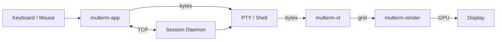

# Multerm

[](LICENSE)

**A GPU-accelerated, workspace-first terminal for people who live in the shell — and the agents inside it.**

Open source and free to use, modify, and distribute under the [MIT License](LICENSE).

Multerm is a Rust terminal emulator built around floating panes, persistent sessions, and a UI that treats AI coding tools as first-class citizens. Run shells, Claude Code, Codex, Cursor Agent, and more side by side — with git diffs, image paste, and a cyberpunk theme when you're feeling dramatic.

```
┌─────────────────────────────────────────────────────────────────────────┐
│  ● Workspace: backend-api          ● Workspace: experiments             │
├─────────────────────────────────────────────────────────────────────────┤
│  ┌──────────────────┐  ┌──────────────────┐  ┌──────────────────┐    │
│  │ ▶ zsh            │  │ ✦ Claude Code    │  │ ◈ Cursor Agent   │    │
│  │                  │  │                  │  │                  │    │
│  │  $ git status    │  │  > fix the auth  │  │  > refactor api  │    │
│  │                  │  │                  │  │                  │    │
│  └──────────────────┘  └──────────────────┘  └──────────────────┘    │
│                                                                         │
│  ~/Projects/backend-api                              [Git] [Images]   │
└─────────────────────────────────────────────────────────────────────────┘
```

---

## Features

### Terminal core

- **GPU rendering** — wgpu compositor with cosmic-text glyph atlas, ANSI colors, wide-character support, and a hardware cursor
- **Full VT parser** — SGR styling, scrollback buffer, bracketed paste, application cursor keys, and tab stops via `vte`
- **Two frontends**
  - **`multerm-ui`** — the full workspace UI (eframe / egui) — *recommended*
  - **`multerm`** — a lean winit + wgpu renderer with up to four resizable split panes
- **Session daemon** — background PTY owner that keeps shell state alive when you close and reopen the app; replays scrollback on reattach
- **tmux integration** — each terminal pane gets a stable tmux session name for reattachment across restarts

### Workspaces & layout

- **Multiple workspaces** — each with its own working directory, terminal layout, and color
- **Tab strip or sidebar** — switch workspace navigation between a horizontal tab bar and a resizable left sidebar
- **Floating terminal panes** — drag, resize, and snap panes with neighbor gap guides and layout metrics overlay
- **Panel layout modes**
  - **Auto** — column count adapts to viewport width
  - **Fixed** — explicit column/row grid
  - **Auto-fit width** — panes snap to column stripes and restack from the top
  - **Equal-size grid** — uniform pane sizes that fill the workspace
- **Fullscreen pop-out** — double-click a pane title to open it in a dedicated native fullscreen window
- **Persistent state** — workspaces, pane positions, themes, and uploaded images saved to `~/.multerm/multerm-ui-workspaces.json`

### AI agent terminals

Launch coding agents directly from the right-click context menu:

| Agent | Command | Menu visibility |
|-------|---------|-----------------|
| Claude Code | `claude` | Always |
| Codex | `codex` | Always |
| Cursor Agent | `cursor-agent` | When installed |
| Gemini | `gemini` | When installed |

Each agent pane gets a distinct badge and icon. Terminals spawned through the daemon survive UI restarts — your agent sessions keep running.

### Git integration

- **Per-terminal change attribution** — tracks files touched while a terminal session is active
- **VS Code–style changes panel** — browse modified/added/deleted/untracked files with status badges
- **Inline unified diff viewer** — syntax-colored hunks with line gutters
- **Commit from the UI** — stage and commit attributed paths without leaving Multerm
- **Live filesystem watching** — debounced `notify` watchers refresh the panel as files change

### Clipboard & images

- **Smart paste** — strips shell prompts, box-drawing separators, and common indentation artifacts before sending text to the PTY
- **Bracketed paste** — respects the terminal's bracketed-paste mode (`\x1b[200~…\x1b[201~`)
- **Rich copy** — `⌘⇧C` / `Ctrl+Shift+C` copies selection with ANSI SGR sequences preserved
- **Plain copy** — `⌘C` / `Ctrl+Shift+C` for shell-friendly plain text
- **Image paste** — paste images from the system clipboard; saved locally and available in the gallery
- **Image gallery** — per-workspace thumbnail grid with rubber-band multi-select, fullscreen preview, copy-to-clipboard, and paste-into-active-terminal
- **Patched egui-winit** — handles image-only clipboard data that stock egui would reject

### Search & editing

- **Scrollback search** — `⌘F` / `Ctrl+F` finds text in the host scrollback buffer (not the live PTY stream); `F3` / `Enter` to navigate matches
- **Per-pane line editor** — shadow input buffer with undo/redo that tracks cursor position across edits
- **Mouse selection** — click-and-drag text selection with word-boundary snapping; double-click selects words
- **Workspace undo/redo** — `⌥⌘Z` / `Alt+Ctrl+Z` to undo layout and workspace changes, with a transient overlay feed

### Themes & visuals

| Theme | Vibe |
|-------|------|
| **Dark** | Clean, low-glare default |
| **Light** | Bright workspace for daytime |
| **Cyberpunk** | Neon borders, mouse-tracking light beam, atmospheric shimmer |

- **Normal / Glass** style overlay — frosted-glass panel treatment on top of any theme
- **Cyberpunk tuning** — adjustable light speed, beam width, brightness, shimmer, halos, radial glow, and orbit dots
- **Performance mode** — disables animations while keeping the visual style intact
- **Custom workspace colors** — per-tab color picker with hex input and color history

### System monitoring

- **Multerm usage panel** — CPU, RAM, and UI FPS for the Multerm process
- **System usage panel** — machine-wide CPU, memory, and load averages via `sysinfo`

---

## Keyboard shortcuts

| Action | macOS | Linux / Windows |
|--------|-------|-----------------|
| New terminal | `⌘⇧N` | `Ctrl+Shift+N` |
| Find in scrollback | `⌘F` | `Ctrl+F` |
| Next match | `F3` | `F3` |
| Undo (line editor) | `⌘Z` | `Ctrl+Z` |
| Redo (line editor) | `⌘⇧Z` | `Ctrl+Shift+Z` |
| Undo (workspace) | `⌥⌘Z` | `Alt+Ctrl+Z` |
| Redo (workspace) | `⌥⌘⇧Z` | `Alt+Ctrl+Shift+Z` |
| Copy (plain) | `⌘C` | `Ctrl+Shift+C` |
| Copy (ANSI) | `⌘⇧C` | — |
| Paste | `⌘V` | `Ctrl+Shift+V` |
| Select all (scrollback) | `⌘A` / `⌘⇧A` | `Ctrl+Shift+A` |
| Insert image (file picker) | `⌘⇧I` | — |
| Close gallery / search | `Esc` | `Esc` |

---

## Downloads

Pre-built binaries are published on [GitHub Releases](https://github.com/elyric10-dev/multerm/releases) when a version tag is pushed (e.g. `v0.1.0`).

| Platform | Artifact | How to run |
|----------|----------|------------|
| **macOS** (Apple Silicon) | `Multerm-*-macos-arm64.zip` or `.dmg` | Open `Multerm.app` |
| **Linux** (x86_64) | `multerm-*-linux-x86_64.tar.gz` | Extract, then `./bin/multerm-ui` |
| **Windows** (x86_64) | `multerm-*-windows-x86_64.zip` | Extract, then `.\bin\multerm-ui.exe` |

### macOS first launch

Release builds are not code-signed. On first open, macOS may block the app — right-click `Multerm.app` → **Open**, or allow it in **System Settings → Privacy & Security**.

### Windows notes

Multerm runs on Windows with the full workspace UI, session daemon, and GPU rendering (DirectX 12 via wgpu). A few Unix-centric features are unavailable or differ:

- **tmux integration** — not used on Windows (plain `cmd.exe` / PowerShell PTY sessions instead)
- **Config path** — `%LOCALAPPDATA%\multerm\` (not `~/.multerm`)
- **SmartScreen** — unsigned builds may show a one-time warning on first launch

### Build a release package locally

```bash
cargo build --release -p multerm-app --bins

# macOS → .app + .zip (+ .dmg when hdiutil is available)
./scripts/package-macos.sh v0.1.0

# Linux → .tar.gz
./scripts/package-linux.sh v0.1.0
```

On Windows (PowerShell):

```powershell
cargo build --release -p multerm-app --bins
.\scripts\package-windows.ps1 v0.1.0
```

Outputs land in `dist/`.

### Publish a release (maintainers)

Push a version tag to trigger the release workflow:

```bash
git tag v0.1.0
git push origin v0.1.0
```

GitHub Actions builds macOS, Linux, and Windows packages and attaches them to the release automatically.

---

## Getting started

### Prerequisites

- [Rust](https://rustup.rs/) (2021 edition)
- A GPU with wgpu support (Vulkan, Metal, or DirectX 12)
- macOS, Linux, or Windows

Optional but useful:

- `tmux` — session persistence inside panes
- `git` — changes panel and diff viewer
- `claude`, `codex`, `cursor-agent`, or `gemini` CLI tools — agent terminal launchers

### Build

```bash
cargo build --release
```

Binaries land in `target/release/`:

```bash
# Full workspace UI (recommended)
./target/release/multerm-ui

# Lean GPU split-pane terminal
./target/release/multerm
```

### Run in development

```bash
cargo run -p multerm-app --bin multerm-ui
cargo run -p multerm-app --bin multerm
```

The UI automatically spawns the session daemon on startup. To run it manually:

```bash
./target/release/multerm-ui --daemon
# or
./target/release/multerm --daemon
```

---

## Architecture

Multerm is a Cargo workspace with a clean separation between parsing, rendering, and UI:

```
multerm-app/        Application binaries (multerm, multerm-ui) + daemon
multerm-core/       PTY spawning, sessions, workspace IDs
multerm-vt/         VT100/ANSI parser and terminal grid
multerm-render/     wgpu compositor, glyph atlas, selection
multerm-input/      Key event → PTY byte translation
multerm-ui/         Shared pane layout primitives
egui-winit-patched/ Patched egui-winit (image-only clipboard support)
```



### Session daemon

When `multerm-ui` starts, it launches a background daemon that owns PTY processes. Closing the window detaches; reopening reattaches and replays buffered output. State lives in `~/.multerm/daemon_port.txt`.

---

## Configuration

Environment variables:

| Variable | Default | Description |
|----------|---------|-------------|
| `MULTERM_DAEMON_DISABLED` | — | Set to `1` to skip the session daemon and use local PTYs only |
| `MULTERM_DAEMON_SESSION_PREFIX` | `multerm` | Prefix for daemon session keys |
| `MULTERM_DAEMON_HISTORY_BYTES` | `8388608` | Max replay buffer size per daemon session (bytes) |
| `MULTERM_TMUX_DISABLED` | — | Set to `1` to disable tmux auto-attach in the winit frontend |
| `MULTERM_TMUX_SESSION_PREFIX` | `multerm` | Prefix for tmux session names |
| `MULTERM_TMUX_AUTO_INSTALL` | `0` | Set to `1` to attempt `brew install tmux` on macOS when missing |
| `RUST_LOG` | `multerm=debug` | Tracing filter (set before launch) |

Persistent UI state:

- **Unix:** `~/.multerm/multerm-ui-workspaces.json`
- **Windows:** `%LOCALAPPDATA%\multerm\multerm-ui-workspaces.json`

---

## Why Multerm?

Most terminal emulators give you tabs. Multerm gives you **workspaces** — project-scoped canvases where you arrange shells and AI agents like windows on a desk. Sessions survive restarts. Git changes are attributed to the terminal that made them. Images paste cleanly into agent CLIs. And when you want the vibes, Cyberpunk mode turns your terminal into something that belongs in a Ridley Scott film.

Built in Rust. Rendered on the GPU. Designed for the way you actually work.

---

## Contributing

Contributions are welcome. To get started:

1. Fork the repository and create a branch for your change
2. Run `cargo build` and `cargo test` before opening a pull request
3. Keep changes focused — match the existing code style and conventions

Bug reports and feature requests are appreciated via GitHub Issues.

---

## License

Multerm is [MIT licensed](LICENSE).

Copyright (c) 2026 elyric10-dev
